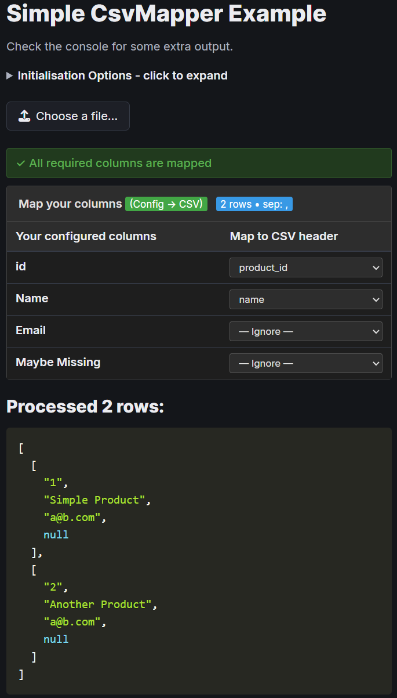

# CSV Mapper

[](https://badge.fury.io/js/@manticorp/csv-mapper)
[](https://opensource.org/licenses/MIT)

Do you need to accept CSV files from users? Then this library is for you!



**CSV Mapper** is a powerful JavaScript library that dynamically remaps CSV columns with an intuitive UI for column mapping. It handles the complexity of CSV parsing, validation, and transformation while providing a seamless user experience.

## Table of Contents

- [Key Features](#key-features)
- [Installation](#installation)
- [Quick Start](#quick-start)
- [Usage Examples](#usage-examples)
- [CSV Parsing Capabilities](#csv-parsing-capabilities)
- [Configuration](#configuration)
- [Column Specifications](#column-specifications)
- [Built-in Transformations](#built-in-transformations)
- [Built-in Validations](#built-in-validations)
- [Events](#events)
- [API Reference](#api-reference)
- [Troubleshooting](#troubleshooting)
- [Contributing](#contributing)

## Key Features

* 🎯 **Smart Column Mapping** - Automatic column detection with fuzzy matching
* 🎨 **User-Friendly UI** - Intuitive interface for manual column mapping
* 🔧 **Data Transformation** - Built-in transformations (case conversion, formatting, etc.)
* ✅ **Validation** - Comprehensive validation system with custom rules
* 📊 **Robust CSV Parsing** - Handles complex CSV formats using PapaParse
* 🌐 **Universal** - Works in browsers and Node.js
* 📱 **Responsive** - Mobile-friendly mapping interface
* ⚡ **Performant** - Efficient processing of large CSV files

## Installation

### NPM

```bash
npm install @manticorp/csv-mapper
```

### CDN (Browser)

```html
<!-- UMD (recommended for browser) -->
<script src="https://unpkg.com/@manticorp/csv-mapper/dist/csv-mapper.umd.min.js"></script>

<!-- ES Module -->
<script type="module">
import CsvMapper from 'https://unpkg.com/@manticorp/csv-mapper/dist/csv-mapper.esm.min.js';
</script>
```

### Local Files

Download the latest release and include the appropriate file:

```html
<script src="path/to/csv-mapper.umd.min.js"></script>
```

## Quick Start

### Basic Browser Usage

```html
<!DOCTYPE html>
<html>
<head>
    <title>CSV Mapper Example</title>
</head>
<body>
    <input id="csv-input" type="file" accept=".csv">
    <div id="mapping-controls"></div>
    
    <script src="https://unpkg.com/@manticorp/csv-mapper/dist/csv-mapper.umd.min.js"></script>
    <script>
        const mapper = new CsvMapper('#csv-input', {
            columns: ['name', 'email', 'phone'],
            controlsContainer: '#mapping-controls'
        });
        
        mapper.addEventListener('afterRemap', (e) => {
            console.log('Mapped CSV:', e.detail.csv);
            // Upload to your server or process the data
        });
    </script>
</body>
</html>
```

### ES Module Usage

```javascript
import CsvMapper from '@manticorp/csv-mapper';

const mapper = new CsvMapper('#csv-input', {
    columns: [
        'product_id',
        'name', 
        'price',
        'category'
    ]
});
```

### Node.js Usage

```javascript
const CsvMapper = require('@manticorp/csv-mapper');

const mapper = new CsvMapper({
    columns: ['id', 'name', 'email']
});

const csvText = `id,full_name,email_address
1,John Doe,john@example.com
2,Jane Smith,jane@example.com`;

const result = mapper.mapCsv(csvText);
if (result) {
    console.log(result.csv);
    console.log('Validation:', result.validation);
}
```

## Usage Examples

### E-commerce Product Import

```javascript
const mapper = new CsvMapper('#csv-input', {
    columns: [
        { name: 'sku', required: true, validate: /^[A-Z0-9-]+$/ },
        { name: 'name', required: true, transform: 'trim' },
        { name: 'price', required: true, validate: 'number', transform: 'number' },
        { name: 'category', transform: 'title' },
        { name: 'stock', validate: 'number', defaultValue: '0' }
    ],
    remap: true,
    setInputValidity: true
});

mapper.addEventListener('validationFailed', (e) => {
    console.log('Validation errors:', e.detail.validation.errors);
    showErrorsToUser(e.detail.validation.errors);
});

mapper.addEventListener('afterRemap', (e) => {
    uploadToServer(e.detail.csv);
});
```

### User Data Processing

```javascript
const mapper = new CsvMapper('#user-csv', {
    columns: [
        { name: 'email', required: true, validate: 'email' },
        { name: 'first_name', transform: 'title' },
        { name: 'last_name', transform: 'title' },
        { name: 'phone', validate: 'phone' },
        { name: 'signup_date', validate: 'date', transform: { type: 'date', format: 'Y-m-d' } }
    ]
});
```

### Headless Usage (No UI)

Perfect for server-side processing or when you don't need user interaction:

```javascript
const mapper = new CsvMapper({
    columns: [
        'id',
        'name',
        { name: 'email', match: header => /email|e-mail/i.test(header) },
        { name: 'phone', match: header => /phone|tel|mobile/i.test(header) }
    ],
    showUserControls: false
});

const result = mapper.mapCsv(csvString);
```

## CSV Parsing Capabilities

The library uses [PapaParse](https://www.papaparse.com/) for robust CSV parsing that properly handles:

### Multiline Fields
```csv
product_id,name,description
1,"Multi-line
Product Name
With Breaks","Long description here"
2,"Another Product","Simple description"
```

### Various Quote Styles
- Standard double quotes: `"field with spaces"`
- Escaped quotes: `"field with ""quotes"" inside"`
- Mixed content: `"field with, comma and ""quotes"""`

### Different Separators and Dialects
- Comma-separated (CSV): `field1,field2,field3`
- Semicolon-separated: `field1;field2;field3`
- Tab-separated (TSV): `field1	field2	field3`
- Pipe-separated: `field1|field2|field3`

The library automatically detects the dialect or you can specify it explicitly.

## Built-in Transformations

CSV Mapper includes several built-in transformations that can be applied to column data:

| Transformation | Description | Example |
|---|---|---|
| `'string'` | Convert to string | `123` → `"123"` |
| `'number'` | Parse as number (handles currency, percentages, etc.) | `"$1,234.56"` → `"1234.56"` |
| `'boolean'` | Convert to boolean representation | `"yes"` → `"1"`, `"no"` → `"0"` |
| `'date'` | Parse and format dates | `"12/31/2023"` → `"2023-12-31"` |
| `'uppercase'` | Convert to uppercase | `"hello"` → `"HELLO"` |
| `'lowercase'` | Convert to lowercase | `"HELLO"` → `"hello"` |
| `'trim'` | Remove leading/trailing whitespace | `" hello "` → `"hello"` |
| `'title'` | Convert to title case | `"hello world"` → `"Hello World"` |
| `'camel'` | Convert to camelCase | `"hello world"` → `"helloWorld"` |
| `'pascal'` | Convert to PascalCase | `"hello world"` → `"HelloWorld"` |
| `'snake'` | Convert to snake_case | `"hello world"` → `"hello_world"` |
| `'kebab'` | Convert to kebab-case | `"hello world"` → `"hello-world"` |
| `'screaming_snake'` | Convert to SCREAMING_SNAKE_CASE | `"hello world"` → `"HELLO_WORLD"` |
| `'ascii'` | Convert to ASCII (remove accents) | `"café"` → `"cafe"` |

### Using Transformations

```javascript
const columns = [
    { name: 'price', transform: 'number' },
    { name: 'name', transform: ['trim', 'title'] },
    { name: 'slug', transform: ['lowercase', 'kebab'] },
    { name: 'custom', transform: (value) => value.replace(/[^a-zA-Z0-9]/g, '') }
];
```

## Built-in Validations

CSV Mapper provides built-in validation types for common data formats:

| Validation | Description | Example |
|---|---|---|
| `'email'` | Valid email address format | `user@example.com` |
| `'number'` | Valid number (with min/max options) | `123.45` |
| `'boolean'` | Boolean values (true/false, yes/no, 1/0) | `true`, `yes`, `1` |  
| `'date'` | Valid date format | `2023-12-31`, `12/31/2023` |
| `'phone'` / `'tel'` | Phone number format | `+1-555-123-4567` |
| `'time'` | Time format (HH:MM:SS) | `14:30:00`, `2:30 PM` |
| `'datetime'` | Date and time combined | `2023-12-31T14:30:00Z` |

### Using Validations

```javascript
const columns = [
    { name: 'email', validate: 'email' },
    { name: 'age', validate: { type: 'number', min: 0, max: 120 } },
    { name: 'phone', validate: 'phone' },
    { name: 'website', validate: /^https?:\/\/.+/ },
    { name: 'status', validate: (value) => ['active', 'inactive'].includes(value) }
];
```

## Headless Usage (No UI)

CsvMapper can optionally be run using no UI for server-side processing or automated workflows.

Here is an example using no UI:

```javascript
    const columns = [
        'id',
        'name',
        'address_line_1',
        'address_line_2',
        {
            name: 'town',
            transform: ['title']
        },
        {
            name: 'county',
            match: (header) => ['county', 'state', 'region'].includes(header.trim().toLowerCase())
        },
        {
            name: 'postcode',
            match: (header) => ['postcode', 'postalcode', 'zip'].includes(header.replace(/\s*/g, '').toLowerCase()),
            required: true
        },
    ];
    const csvMapper = new CsvMapper({
        columns,
    });

    const csv = `id,name,address_line_1,town,state,zip
1,John,123 fake street,Fakesham,Fakesberg,12345;
2,Mary,456 Real Road,margheritavill,,67890`;

    const result = csvMapper.mapCsv(csv);
    if (result) {
        console.log(result.csv);
        // and upload to server, or save, or whatver.
    }

```

## Configuration

```html
<input id="csv" type="file" accept=".csv">
<input id="map" type="hidden">
<div id="remapping-controls"></div>
<script type="module">
import CsvMapper from "./../dist/csv-mapper.js";

const columns = [
    'name',
    {name: 'barcode', outputHeader: 'upc'},
    {name: 'sku', title: 'SKU'},
];

const mapper = new CsvMapper('#csv', {
    columns: columns,                   // Column specification

    // Parsing/dialect
    headers: true,
    separator: '',
    enclosure: '',
    escape: '',

    output: {
        generateCsv: true, // Whether to generate output CSV string
        delimiter: ',',
        quoteChar: '"',
        escapeChar: '\\',
        newline: '\n',
        allowUnmappedTargets: false, // Whether to allow csv columns that are unmapped in the input into the output
    },

    // Library behavior
    remap: true,                   // Whether to attempt remapping
    showUserControls: true,        // Defaults to true if input is present, false if not
    mappingInput: null,            // HTMLElement | false
    controlsContainer: null,       // selector | element | null
    autoThreshold: 0.8,            // Similarity threshold for auto column mapping
    setInputValidity: false,       // Whether to use setCustomValidity on the file input
    mappingMode: 'configToCsv',    // Default mapping direction
    allowMultipleSelection: false, // Whether to allow many-to-many mapping

    uiRenderer: null,              // UI renderer - accepts string ("default") or a renderer object
    transformer: null,             // Data transformer/validator
    parser: null,                  // CSV parser
});
</script>
```

## Column Specifications

The columns configuration is highly flexible and supports many options:

```javascript
const columns = [ // Columns should be an array
    'id', // You can pass a simple string
    'name',
    {     // Or it can be defined with an object
        name: 'sku',
        validate: /^SKU[0-9]+$/
    },
    {
        // This, by default, is used for the output csv header and UI display.
        name: 'barcode',

        // This displays in the UI.
        title: 'Barcode',

        // This displays in the UI as a tooltip (title="description").
        description: 'The UPC barcode',

        // This displays in the UI as a visible comment.
        comment: 'must be of the format 01234567890',

        // This will be what's used in the remapped output.
        outputHeader: 'UPC',

        // Default value to be used if not present in mapping.
        defaultValue: '0',

        // Whether the column is required for remapping (default: false).
        required: true,

        // Whether the column is allowed to be mapped multiple times.
        allowDuplicates: false,

        // Function/regex for matching to supplied CSV headers.
        match: (header) => ['barcode', 'upc', 'isbn'].includes(header.toLowerCase()),

        // A transformation function or list of transformions. Some default built ins are provided which you can reference by string.
        transform: ['string', 'upper', (str) => str.split('-').map(a => a.trim()).join('')],

        // A string (e.g. 'email', 'date'), regex or function for validation.
        validate: /^(?=.*0)[0-9]{12}$/,

        // Validation message supplied to the user.
        validationMessage: '"Barcode" should be a valid UPC-A barcode.',
    }
];
```

## Events

This is a full list of events emitted by CsvMapper which you can listen to.

All events emit a CustomEvent object upon which all parameters reside in the "detail" key.

```javascript
csvMapper.addEventListener('beforeParseCsv', (e) => {
    console.log(e.detail.csv);
});
```

| Event | Description |
|-|-|
| ```beforeParseCsv``` | before parsing CSV text |
| ```afterParseCsv``` | after parsing CSV text |
| ```afterRead``` | after reading file text (before parsing) |
| ```mappingChange``` | when the mapping changes (user or programmatically) |
| ```mappingFailed``` | when mapping is invalid (e.g. required columns missing) |
| ```mappingSuccess``` | when mapping is valid |
| ```beforeMap``` | before validating the mapping |
| ```afterMap``` | after validating the mapping |
| ```beforeRemap``` | before remapping data |
| ```afterRemap``` | after remapping data |
| ```validationFailed``` | after remapping, if there were validation errors |
| ```validationSuccess``` | after remapping, if there were no validation errors |
| ```transformationFail``` | when a transformation error occurs during data transformation |
| ```validationFail``` | when a validation error occurs during data transformation |

### ```beforeParseCsv```

```javascript
event = {
    detail: {
        csv // The csv text passed in
    }
}
```

### ```afterParseCsv```

```javascript
event = {
    detail: {
        csv: {
            headers,
            rows,
            rawRows,
            dialect: {
                    separator,
                    enclosure,
                    escape,
                }
            },
        }
    }
}
```

### ```afterRead```

```javascript
event = {
    detail: {
        text // csv text
    }
}
```

Triggered after reading file text (before parsing). You can modify the CSV text before it gets parsed:

```javascript
csvMapper.addEventListener('afterRead', (e) => {
    // Replace the entire CSV content
    e.detail.text = `id,sku\n1,abc`;

    // Or modify existing content
    e.detail.text = e.detail.text.replace(/old_header/g, 'new_header');
});
```

### ```mappingChange```

```javascript
event = {
    detail: {
        mapping // Current mapping object
    }
}
```

Triggered when the mapping changes (either through user interaction or programmatically). The mapping can be either simple strings or arrays (for many-to-many mapping):

```javascript
csvMapper.addEventListener('mappingChange', (e) => {
    console.log('New mapping:', e.detail.mapping);
    // e.g. { 'CSV Header': 'target_column' } or { 'CSV Header': ['col1', 'col2'] }
});
```

### ```mappingFailed```

```javascript
event = {
    detail: {
        isValid,         // false
        missingRequired, // Array of missing required column names
        mappedTargets,   // Array of successfully mapped target columns
        mapping          // Current mapping object
    }
}
```

Triggered when mapping validation fails (e.g., required columns are missing):

```javascript
csvMapper.addEventListener('mappingFailed', (e) => {
    console.log('Missing required columns:', e.detail.missingRequired);
    // Show user feedback about missing columns
});
```

### ```mappingSuccess```

```javascript
event = {
    detail: {
        isValid,       // true
        mappedTargets, // Array of successfully mapped target columns
        mapping        // Current mapping object
    }
}
```

Triggered when mapping validation succeeds (all required columns are mapped):

```javascript
csvMapper.addEventListener('mappingSuccess', (e) => {
    console.log('All required columns mapped successfully');
    // Enable submit button or continue processing
});
```

### ```beforeMap```

```javascript
event = {
    detail: {
        csv // Current CSV object
    }
}
```

Triggered before validating the mapping. You can prevent the mapping process by calling `preventDefault()`:

```javascript
csvMapper.addEventListener('beforeMap', (e) => {
    if (someCondition) {
        e.preventDefault(); // Cancel mapping process
    }
});
```

### ```afterMap```

```javascript
event = {
    detail: {
        csv,     // Current CSV object
        isValid  // Boolean indicating if mapping is valid
    }
}
```

Triggered after mapping validation is complete:

```javascript
csvMapper.addEventListener('afterMap', (e) => {
    if (e.detail.isValid) {
        console.log('Mapping validation passed');
    } else {
        console.log('Mapping validation failed');
    }
});
```

### ```beforeRemap```

```javascript
event = {
    detail: {
        csv // Current CSV object
    }
}
```

Triggered before remapping data. You can prevent the remapping process by calling `preventDefault()`:

```javascript
csvMapper.addEventListener('beforeRemap', (e) => {
    if (needsConfirmation) {
        e.preventDefault(); // Cancel remapping
    }
});
```

### ```afterRemap```

```javascript
event = {
    detail: {
        rows, // Remapped data rows
        csv   // Generated CSV string
    }
}
```

Triggered after data remapping is complete:

```javascript
csvMapper.addEventListener('afterRemap', (e) => {
    console.log('Remapped CSV:', e.detail.csv);
    // Upload to server or save locally
});
```

### ```validationFailed```

```javascript
event = {
    detail: {
        data,       // Transformed CSV data object
        csv,        // Generated CSV string
        validation  // Validation result object with errors
    }
}
```

Triggered after remapping when there are validation errors in the data:

```javascript
csvMapper.addEventListener('validationFailed', (e) => {
    console.log('Validation errors:', e.detail.validation.errors);
    console.log('Total errors:', e.detail.validation.totalErrors);
    console.log('Error rows:', e.detail.validation.errorRows);
    // Display validation errors to user
});
```

### ```validationSuccess```

```javascript
event = {
    detail: {
        data,       // Transformed CSV data object
        csv,        // Generated CSV string
        validation  // Validation result object (no errors)
    }
}
```

Triggered after remapping when all data passes validation:

```javascript
csvMapper.addEventListener('validationSuccess', (e) => {
    console.log('All data validated successfully');
    console.log('Total rows processed:', e.detail.validation.totalRows);
    // Proceed with data upload or processing
});
```

### ```transformationFail```

```javascript
event = {
    detail: {
        rowIndex,    // Row number where error occurred
        columnName,  // Column name where error occurred
        value,       // Value that caused the error
        message      // Error message
    }
}
```

Triggered when a transformation error occurs during data processing. You can prevent the error from being rethrown by calling `preventDefault()`:

```javascript
csvMapper.addEventListener('transformationFail', (e) => {
    console.log(`Transformation error in row ${e.detail.rowIndex}, column ${e.detail.columnName}`);
    console.log(`Value: ${e.detail.value}, Error: ${e.detail.message}`);

    // Prevent error from being rethrown (continue processing)
    // e.preventDefault();
});
```

### ```validationFail```

```javascript
event = {
    detail: {
        rowIndex,    // Row number where validation failed
        columnName,  // Column name where validation failed
        value,       // Value that failed validation
        message      // Validation error message
    }
}
```

Triggered when a single field validation fails during data processing:

```javascript
csvMapper.addEventListener('validationFail', (e) => {
    console.log(`Validation error in row ${e.detail.rowIndex}, column ${e.detail.columnName}`);
    console.log(`Value: "${e.detail.value}" - ${e.detail.message}`);
    // Log validation errors for debugging
});
```

## API Reference

### Constructor

```javascript
new CsvMapper(input?, options?)
```

- **input** (`string | HTMLElement | null`): CSS selector or HTML element for file input
- **options** (`object`): Configuration options

### Methods

| Method | Description | Returns |
|---|---|---|
| `mapCsv(csvText)` | Process CSV text and return mapped result | `MappedOutput | null` |
| `setFile(file)` | Set CSV file to process | `Promise<void>` |
| `setMapping(mapping)` | Set column mapping programmatically | `void` |
| `getMapping()` | Get current column mapping | `object` |
| `autoMap()` | Automatically map columns using fuzzy matching | `void` |
| `render()` | Re-render the UI controls | `void` |
| `destroy()` | Clean up event listeners and DOM elements | `void` |

### Result Object

The `mapCsv()` method returns a `MappedOutput` object:

```javascript
{
    data: Csv,           // Transformed CSV data object
    csv: string,         // Generated CSV string
    validation: {        // Validation results
        errors: ValidationError[],
        totalRows: number,
        errorRows: number,
        totalErrors: number,
        errorsByField: object
    }
}
```

## Troubleshooting

### Common Issues

**File not being processed**
- Ensure the file input has the correct `accept` attribute: `accept=".csv"`
- Check that the file is actually a CSV (not Excel or other format)
- Verify event listeners are attached before user interaction

**Mapping UI not appearing**
- Make sure `showUserControls` is not set to `false`
- Check that `controlsContainer` points to a valid DOM element
- Ensure the CSV has headers (`headers: true` in options)

**Validation errors not showing**
- Check that validation rules are correctly defined
- Use `validationFailed` event to debug validation issues
- Verify column names match between mapping and validation rules

**Performance issues with large files**
- Consider processing files in chunks for very large CSVs (>10MB)
- Use `remap: false` if you don't need the remapped file
- Disable UI rendering for headless processing

### Memory Considerations

- Files larger than 50MB may cause memory issues in browsers
- Consider server-side processing for very large files
- Use streaming parsers for Node.js applications with massive datasets

### Browser Compatibility

- Modern browsers (Chrome 60+, Firefox 55+, Safari 12+, Edge 79+)
- IE11 requires polyfills for Promise and other ES6 features
- File API support required for file upload functionality

## Contributing

We welcome contributions! Please see [CONTRIBUTING.md](CONTRIBUTING.md) for guidelines.

### Development Setup

```bash
git clone https://github.com/manticorp/csv-mapper.git
cd csv-mapper
npm install
npm run build
npm test
```

### Running Tests

```bash
npm test                 # Run all tests
npm run test:watch       # Run tests in watch mode
npm run test:coverage    # Run tests with coverage report
```

## License

MIT License - see [LICENSE](LICENSE) file for details.
